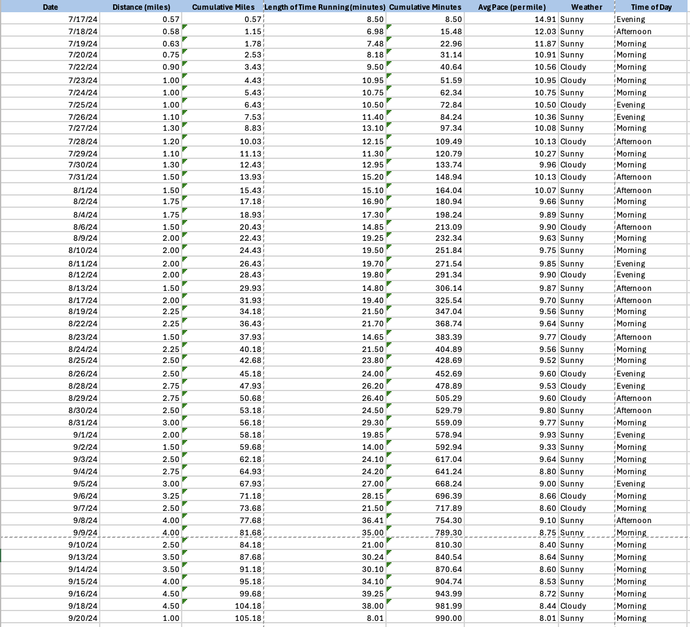
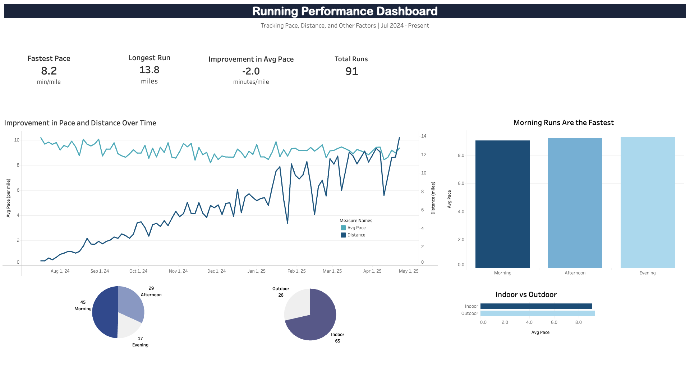
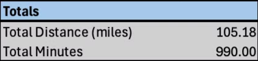
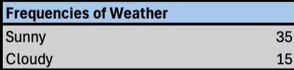
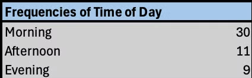

# Running Performance Tracking and Analysis

## Project Overview
This project analyzes personal running performance using historical data logged on Strava. By leveraging statistical calculations, visualizations, and time series analysis in Microsoft Excel, it aims to uncover trends in running distance, pace, and duration over days, weeks, and months. External factors such as weather and time of day are also considered to provide deeper insights into running performance.

---

## Data Summary
The dataset tracks several metrics from runs over the past few months. Key columns include:

- **Date**
- **Distance (in miles)**
- **Cumulative Miles Completed**
- **Duration (in minutes)**
- **Cumulative Time Ran (in minutes)**
- **Average Pace (minutes per mile)**
- **Weather**
- **Time of Day**

---

## Exploratory Data Analysis

### **Statistics**
Using Excel formulas like `AVERAGE`, `SUM`, `STDEV.S`, and `MEDIAN`, basic statistics were calculated for metrics like distance, pace, and duration. These calculations provide a quantitative view of performance over time.

### **Data Visualizations**
Key trends and patterns were visualized through graphs, including:

- **Distance Over Time**
- **Cumulative Miles Ran**
- **Average Pace Over Time**
- **Time of Day Analysis**
- **Weather-Based Performance Trends**

---

## Key Insights

### **Time of Day Analysis**
- **Morning Runs** showed the fastest average pace (10.67 min/mile), outperforming afternoon and evening runs.
- Distance remained consistent across times of the day, indicating the time of day impacts pace more than distance.

### **Weather Analysis**
- Runs on **cloudy days** were both longer and faster than on sunny days, suggesting cooler conditions positively influence performance.
- July showed the most significant difference, with a pace of 10.37 min/mile on cloudy days compared to 11.40 min/mile on sunny days.

---

## Future Work
- **Continuous Updates**: The dataset will be updated regularly to track progress throughout the next year.
- **Advanced Analysis**: Incorporate time series analysis for predictive modeling and deeper performance insights.
- **Automation**: Use Excel VBA for dynamic performance alerts, monthly summaries, and custom data entry forms.

Stay tuned for more updates as this journey progresses!
