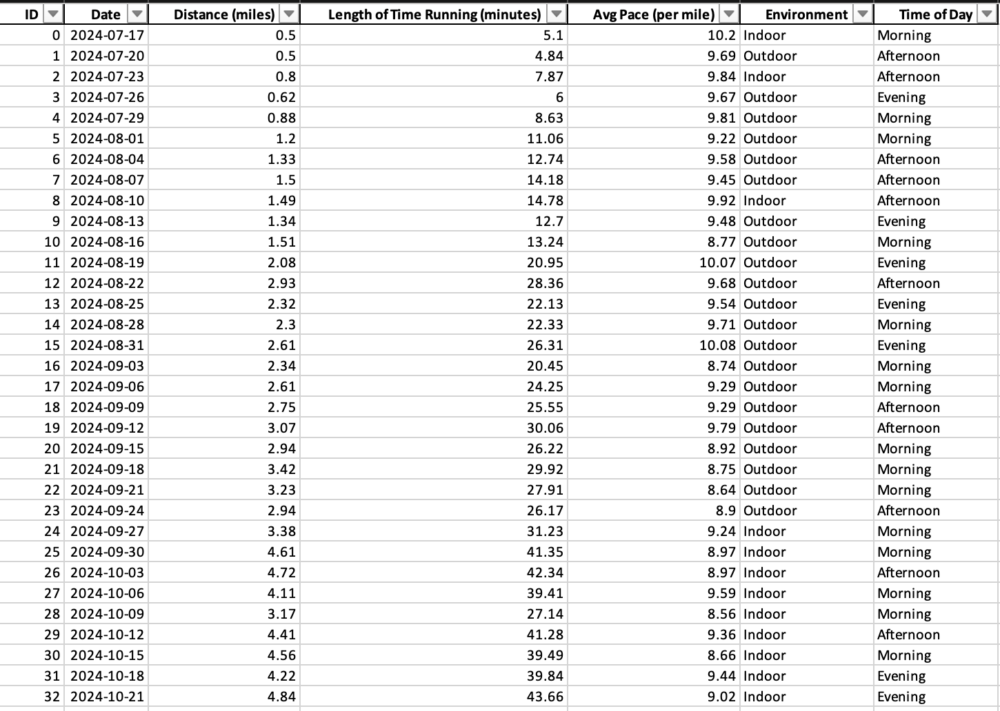

# 🏃‍♂️ Running Performance Tracking & Analysis

## 📌 Project Overview  
This project tracks and analyzes my personal running data using **Microsoft Excel** for data logging and **Tableau** for interactive dashboards. The goal is to uncover trends in **pace**, **distance**, **duration**, and external factors (like environment and time of day) to evaluate performance improvement over time.

---

## 📊 Data Summary  
The dataset includes running logs from **July 2024 to present**, capturing the following metrics:

- **Date**
- **Distance (miles)**
- **Length of Time Running (minutes)**
- **Avg Pace (min/mile)**
- **Environment** (Indoor/Outdoor)
- **Time of Day** (Morning/Afternoon/Evening)

Runs are recorded manually in Excel and visualized through Tableau Public for ongoing performance insights.

---

## 📈 Dashboard Highlights  

- **Fastest Pace:** 8.2 min/mile  
- **Longest Run:** 13.8 miles  
- **Total Runs:** 91  
- **Improvement in Avg Pace:** -2.0 min/mile  

📊 **Interactive Dashboard**:  
[View on Tableau Public](https://public.tableau.com/shared/FQK4J32JH?:display_count=n&:origin=viz_share_link)

---

## 🔍 Key Insights  

### ✅ Pace & Distance Trends  
- Steady **improvement in average pace** over time  
- **Distances gradually increased**, indicating improving endurance

### 🌅 Time of Day Performance  
- **Morning runs** had the fastest pace on average  
- Run breakdown: 45 morning, 29 afternoon, 17 evening  
- Time of day seems to impact pace more than distance

### 🏠 Indoor vs Outdoor  
- Most runs were **indoor** (65 out of 91)  
- **Outdoor runs** showed slightly faster paces on average

---

## 🔮 Future Work  
- Add new metrics like heart rate and elevation (if available)  
- Use time series forecasting to estimate future pace improvements  
- Develop automated alerts using Excel VBA to flag high/low performance days  

---

## 🧠 Tools Used  
- **Microsoft Excel** – Data logging, calculations, and statistical analysis  
- **Tableau Public** – Dashboard creation and data visualization

Stay tuned for ongoing updates as I continue tracking and analyzing my performance!

Stay tuned for ongoing updates as I continue tracking and analyzing my performance!

